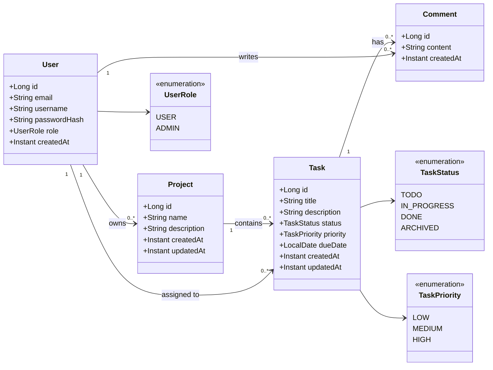

# Domain Model - Projet SI Java (ESIEE‑IT 2025-2026)

---

## Acteurs

| Acteur  | Description                                              |
|---------|----------------------------------------------------------|
| User    | Utilisateur authentifié — crée et gère projets et tâches |
| Admin   | Supervision de la plateforme — gestion des comptes       |
| System  | Actions automatiques (audit, notifications) *(optionnel)*|

---

## Cas d'usage (résumé)

- **UC-01** : En tant que User, je veux **créer un projet** afin de structurer mon travail.
- **UC-02** : En tant que User, je veux **lister mes projets** afin de voir tout ce que je gère.
- **UC-03** : En tant que User, je veux **ajouter une tâche à un projet** afin de planifier les actions.
- **UC-04** : En tant que User, je veux **changer le statut d'une tâche** afin de suivre l'avancement.
- **UC-05** : En tant que User, je veux **ajouter un commentaire à une tâche** afin de documenter le travail.
- **UC-06** : En tant que User, je veux **assigner une tâche à un utilisateur** afin de répartir le travail.
- **UC-07** : En tant que User, je veux **modifier ou supprimer un projet** afin de maintenir ma liste à jour.
- **UC-08** : En tant que Admin, je veux **lister tous les utilisateurs** afin de surveiller la plateforme.

---

## Entités

### User
| Attribut       | Type          | Contraintes              |
|----------------|---------------|--------------------------|
| id             | Long          | PK, auto-généré          |
| email          | String        | obligatoire, unique      |
| username       | String        | obligatoire, unique      |
| passwordHash   | String        | obligatoire (séance 5)   |
| role           | UserRole      | obligatoire, défaut USER |
| createdAt      | Instant       | auto, non modifiable     |

**Règles :**
- email doit être valide (format RFC)
- username entre 3 et 50 caractères
- un User a exactement un rôle

---

### Project
| Attribut     | Type    | Contraintes                   |
|--------------|---------|-------------------------------|
| id           | Long    | PK, auto-généré               |
| name         | String  | obligatoire, 1 à 80 caractères|
| description  | String  | optionnel, max 500 caractères |
| owner        | User    | obligatoire, FK               |
| createdAt    | Instant | auto, non modifiable          |
| updatedAt    | Instant | mis à jour automatiquement    |

**Règles :**
- name est obligatoire et non vide
- un projet a exactement un owner (User)
- seul le owner peut modifier ou supprimer le projet

---

### Task
| Attribut     | Type         | Contraintes                    |
|--------------|--------------|--------------------------------|
| id           | Long         | PK, auto-généré                |
| title        | String       | obligatoire, 1 à 120 caractères|
| description  | String       | optionnel, max 1000 caractères |
| status       | TaskStatus   | obligatoire, défaut TODO       |
| priority     | TaskPriority | optionnel, défaut MEDIUM       |
| project      | Project      | obligatoire, FK                |
| assignee     | User         | optionnel, FK                  |
| dueDate      | LocalDate    | optionnel                      |
| createdAt    | Instant      | auto, non modifiable           |
| updatedAt    | Instant      | mis à jour automatiquement     |

**Règles :**
- title est obligatoire et non vide
- status initial = TODO à la création
- dueDate (si renseignée) ne doit pas être dans le passé
- une tâche appartient à exactement un projet

---

### Comment
| Attribut   | Type    | Contraintes                    |
|------------|---------|--------------------------------|
| id         | Long    | PK, auto-généré                |
| content    | String  | obligatoire, 1 à 500 caractères|
| task       | Task    | obligatoire, FK                |
| author     | User    | obligatoire, FK                |
| createdAt  | Instant | auto, non modifiable           |

**Règles :**
- content obligatoire et non vide
- un commentaire appartient à une tâche et a un auteur
- un commentaire ne peut pas être modifié (optionnel : autoriser uniquement l'auteur)

---

## Enums

### TaskStatus
```
TODO        → tâche créée, pas encore démarrée
IN_PROGRESS → tâche en cours
DONE        → tâche terminée
ARCHIVED    → tâche archivée (état final)
```

### TaskPriority
```
LOW
MEDIUM   (défaut)
HIGH
```

### UserRole
```
USER    (défaut)
ADMIN
```

---

## Relations (cardinalités)

| Relation                  | Type    | Description                               |
|---------------------------|---------|-------------------------------------------|
| User → Project            | 1..N    | Un user peut posséder plusieurs projets   |
| Project → Task            | 1..N    | Un projet contient plusieurs tâches       |
| Task → Comment            | 1..N    | Une tâche peut avoir plusieurs commentaires |
| User → Comment            | 1..N    | Un user peut écrire plusieurs commentaires|
| User → Task (assignee)    | 0..N    | Un user peut être assigné à plusieurs tâches *(optionnel)* |

---

## Workflow de statut (TaskStatus)

### Transitions autorisées
```
TODO        → IN_PROGRESS   (démarrer la tâche)
TODO        → ARCHIVED      (annulation directe)
IN_PROGRESS → TODO          (remettre en attente)
IN_PROGRESS → DONE          (terminer la tâche)
IN_PROGRESS → ARCHIVED      (annulation en cours)
DONE        → ARCHIVED      (archiver)
DONE        → IN_PROGRESS   (réouvrir) ← optionnel
```

### Transitions interdites
```
DONE        → TODO          ← INTERDIT
ARCHIVED    → tout          ← INTERDIT (état final)
```

### Message d'erreur attendu (à implémenter plus tard)
> `"Transition de statut invalide : DONE → TODO"`

---

## Règles métier (invariants)

| ID | Entité  | Règle                                                        |
|----|---------|--------------------------------------------------------------|
| R1 | User    | email obligatoire, unique, format valide                     |
| R2 | User    | au moins un rôle                                             |
| R3 | Project | name obligatoire (1-80 chars)                                |
| R4 | Project | exactement un owner                                          |
| R5 | Project | seul le owner peut modifier/supprimer                        |
| R6 | Task    | title obligatoire (1-120 chars)                              |
| R7 | Task    | status initial = TODO                                        |
| R8 | Task    | transitions de statut contrôlées                             |
| R9 | Task    | dueDate ≥ aujourd'hui si renseignée                          |
| R10| Comment | content obligatoire (1-500 chars)                            |
| R11| Comment | appartient à une tâche et a un auteur                        |

---

## Règles d'autorisation (aperçu — détail en séance 5)

- Un User ne voit que ses propres projets
- Seul le owner d'un projet peut le modifier ou le supprimer
- Seul l'auteur d'un commentaire peut le supprimer
- Un Admin peut tout lire/modifier/supprimer
- Toute requête sans authentification → `401 Unauthorized`
- Accès à une ressource d'un autre user → `403 Forbidden`

---

## Tableau US → Modèle

| User Story                    | Entités impliquées    | Données clés          | Règles métier       |
|-------------------------------|-----------------------|-----------------------|---------------------|
| US-01 Inscription             | User                  | email, passwordHash   | R1, R2              |
| US-02 Connexion               | User                  | email, passwordHash   | R1                  |
| US-05 Créer un projet         | User, Project         | name, owner           | R3, R4              |
| US-06 Lister les projets      | User, Project         | ownerId               | R5                  |
| US-09 Ajouter une tâche       | Project, Task         | title, status, project| R6, R7              |
| US-10 Changer statut tâche    | Task                  | status                | R8                  |

---

## Diagramme de classes (Mermaid)

